Tekijä: Joonas Laine

Kurssi: [Palvelinten hallinta](https://terokarvinen.com/palvelinten-hallinta/)

Päivämäärä: 31.03.2026

## x) Lue ja tiivistä

### Karvinen 2026: Hello Ansible
*https://terokarvinen.com/hello-ansible/*

- Ansible on konfiguraationhallintaväline, jolla infrastruktuuri kuvataan koodina (IaC) - määritellään haluttu lopputila, ja Ansible tekee muutokset vain tarvittaessa (idempotentti)
- Toimii SSH:n yli; orjakoneilla tarvitaan vain SSH-daemon ja Python. Ansible-komentoa tarvitaan vain master-koneella
- Perustiedostot: `hosts.ini` (hallittavat koneet), `ansible.cfg` (yleisasetukset), `site.yml` (mitä rooleja ajetaan millekin koneelle), sekä roolihakemisto `roles/`
- Roolin koodi kirjoitetaan tiedostoon `roles/<rooli>/tasks/main.yml`; YAML-sisennys on kaksi välilyöntiä, ei tabulaattoria

> **Huomio:** Ansiblen hakemistorakenne tuntuu ensin monimutkaiselta suhteessa siihen, mitä yhdellä roolilla saadaan aikaan, mutta sama rakenne skaalautuu kymmenille rooleille ja sadoille koneille ilman muutoksia logiikkaan. Onko järkevää käyttää Ansiblea yksittäisen palvelimen hallintaan, vai tuleeko hyöty vasta useammilla koneilla?

---

### Karvinen 2026: SSH public key - Login without password
*https://terokarvinen.com/ssh-public-key-login-without-password/*

- SSH-avainpariautentikoinnilla voidaan kirjautua palvelimelle ilman salasanaa - tätä käyttävät taustalla mm. git, rsync ja Ansible
- Avainpari luodaan komennolla `ssh-keygen`, julkinen avain kopioidaan kohdepalvelimelle `ssh-copy-id`-komennolla
- Julkinen avain päätyy kohdekoneen tiedostoon `~/.ssh/authorized_keys`, minkä jälkeen kirjautuminen onnistuu automaattisesti

> **Huomio:** Julkinen avain on nimensä mukaisesti julkinen - samaa avainta voi käyttää useilla palvelimilla. Yksityinen avain sen sijaan ei saa koskaan poistua omalta koneelta. Kannattaisiko yksityinen avain silti suojata salasanalla (*passphrase*), vaikka se poistaa osan kätevyydestä?

---

## a) Sshecrets. Asenna SSH-demoni ja testaa se kirjautumalla SSH:lla. & b) Pubkey. Automatisoi ssh-kirjautuminen julkisella avaimella

Ensiksi asennetaan ssh-demoni komennolla `sudo apt install ssh`


Alkuun luodaan SSH-avain komennolla `ssh-keygen`. Kolme kertaa enter luo avaimen oletuskansioihin.

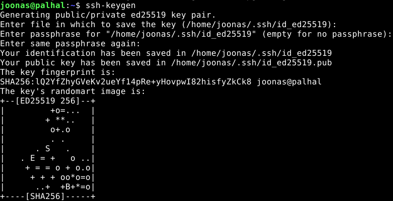

Sitten kopioidaan oma julkinen avain etäyhteydellä käytettävän laitteen .ssh/authorized_keys -tiedostoon komennolla `ssh-copy-id <palvelimen nimi>`, tässä tapauksessa localhost

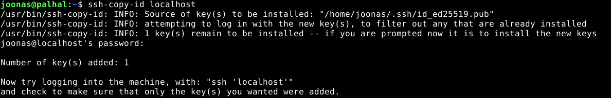

Testataan kirjautuminen ilman salasanaa

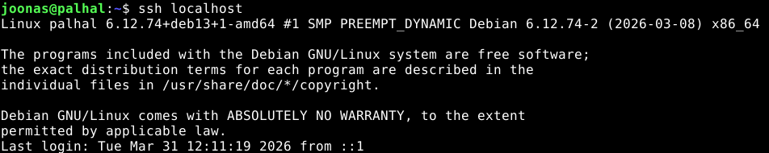

## c) Hei Ansible

Ansible asennettiin Debianin paketinhallinnasta.
```bash
sudo apt-get update
sudo apt-get install ansible micro bash-completion tree
```


---

### hosts.ini ja ansible.cfg

Luotiin `ansible/`-hakemisto ja sinne kaksi konfiguraatiotiedostoa.

`hosts.ini` määrittelee hallittavat koneet:
```ini
localhost

[all:vars]
ansible_python_interpreter=/usr/bin/python3
```

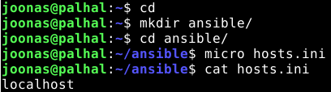

`ansible.cfg` asettaa oletusinventaarion ja verbose-tulostuksen:
```ini
[defaults]
inventory = hosts.ini
display_args_to_stdout = true
```

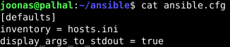


---

### Hakemistorakenne (tree)

Lopullinen hakemistorakenne `tree`-komennolla tarkistettuna:

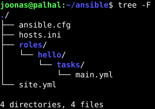


---

### Python-versiovaroitus

Jos Ansible varoittaa Python-tulkin versiosta, lisäämällä `ansible_python_interpreter` hosts.ini-tiedostoon poistaa virheilmoituksen

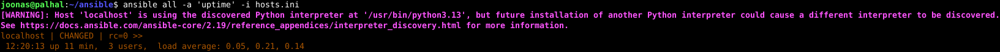

---

### site.yml

`site.yml` määrittää, mitkä roolit ajetaan millekin koneelle:
```yaml
- hosts: all
  roles:
    - hello
```

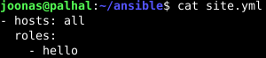

---

### Virheviesti ennen roolin luontia

Ensimmäinen ajo antoi virheen, koska `hello`-roolia ei ollut vielä olemassa:

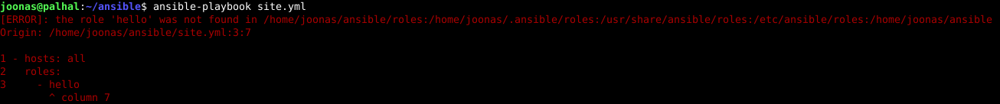

---

### Roolien luonti

Luotiin rooli `roles/hello/tasks/main.yml`, joka kopioi tiedoston `/tmp/`-hakemistoon:
```yaml
- copy:
    dest: /tmp/hello-ansible
    content: "See you at JoonasLaine.com!\n"
```

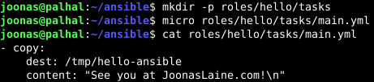

---

### become: true

Järjestelmän hallintaa vaativat tehtävät tarvitsevat sudo-oikeudet. `become: true` lisätään `site.yml`-tiedostoon:

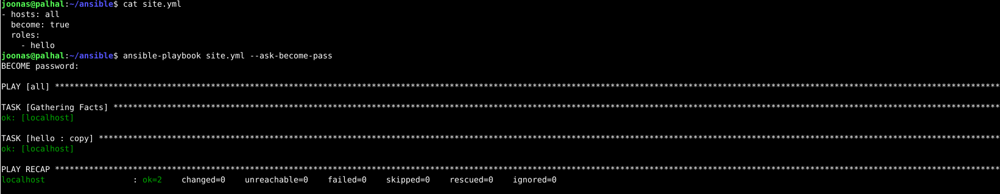

---

### ansible-playbook ajo ja tulos

Ajettiin playbook ja varmistettiin, että tiedosto luotiin onnistuneesti slavelle:


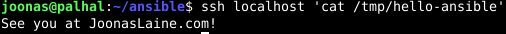

---

## Lähteet:

https://terokarvinen.com/palvelinten-hallinta/

https://terokarvinen.com/hello-ansible/

https://terokarvinen.com/ssh-public-key-login-without-password/

Tekstin jäsentelyyn käytetty [Claude](https://claude.ai)-tekoälyä
