# h2 - Voileipä

Tekijä: Joonas Laine

Kurssi: [Palvelinten Hallinta](https://terokarvinen.com/palvelinten-hallinta/)

Päivämäärä: 7.4.2026

---


Tässä tehtävässä on luettu ja tiivistetty annettuja lähteitä sekä tutustuttu `ansible-doc` -komentoon ja sen moduuleihin.

Tehty myös tehtävät a-e

---

## x) Lue ja tiivistä

### Karvinen 2026: Sudo without password
- Näyttää, miten käyttäjälle voidaan sallia `sudo`-komennon käyttö ilman salasanakyselyä.  
- Muutokset tehdään `/etc/sudoers` tai `/etc/sudoers.d/` -tiedostossa `NOPASSWD`-vaihtoehdolla.  
- Hyödyllinen automatisoinnissa, mutta vaatii huolellisen tietoturvan hallinnan.  
**Oma huomio:** Voiko tämän rajata vain tiettyihin komentoihin, ettei turvallisuus kärsi liikaa?

### Munroe 2006: xkcd 149 - Sandwich
- Humoristinen sarjakuva ohjelmoijien ja "järjestelmien" kirjaimellisesta ajattelusta.  
- Korostaa, että kone tulkitsee käskyt tarkasti, kuten ihminen joskus väärin.  
**Oma kysymys:** Missä on ihmisen ja koneen rajapinta "liian tarkkojen" ohjeiden suhteen?

### Karvinen 2026: Passwordless Sudo with Ansible
- Ohjeistaa, miten `sudo` ilman salasanaa voidaan konfiguroida automaattisesti Ansiblella.  
- Käyttää `copy`-moduulia jakamaan `sudoers`-asetuksia ja varmistaa oikeudet tiedostoille.  
**Oma huomio:** Tämä tekee hallinnan toistettavaksi ja luotettavaksi, mutta asetukset kannattaa testata ensin rajatussa ympäristössä.

---

## Ansiblen sisäänrakennettu dokumentaatio (`ansible-doc`)

Alla tiivistelmät moduuleista, tärkeimmistä optioista sekä esimerkit.

---

### `ansible-doc copy`

**Johdanto:**  
Kopioi tiedostoja paikallisesta lähteestä kohdekoneisiin. Mahdollistaa tiedoston sisällön (`content`) määrittämisen suoraan ilman erillistä `src`-tiedostoa.

**Optiot:**  
- `content`: Tiedoston sisältö suoraan playbookissa.  
- `dest`: Kohdetiedoston sijainti etäkoneella.  
- `src`: Lähdetiedoston polku paikallisella koneella.  
- `owner`, `group`, `mode`: Tiedoston omistajuus ja käyttöoikeudet.

**Esimerkki:**  
```yaml
- name: Kopioi konfiguraatiotiedosto
  ansible.builtin.copy:
    src: config.txt
    dest: /etc/myapp/config.txt
    owner: root
    group: root
    mode: '0644'

```
### `ansible-doc apt`

**Johdanto:**
Hallinnoi paketteja Debian/Ubuntu-järjestelmissä. Toimii samalla periaatteella kuin apt-get.

**Optiot:**

- `name`: Paketin nimi.
- `state`: Asennuksen tila (present, absent, latest).
- `update_cache`: Päivittää pakettiluettelon ennen asennusta.

**Esimerkki:**

```text
- name: Asenna Apache ja päivitä apt-cache
  ansible.builtin.apt:
    name: apache2
    state: present
    update_cache: yes
```

### `ansible-doc file`

**Johdanto:**
Käyttää tiedostojen ja hakemistojen hallintaan – luominen, poistaminen, oikeuksien tai linkkien määrittely.

**Optiot:**

- `path`: Tiedoston tai hakemiston polku.
- `recurse`: Muuttaa oikeudet myös alihakemistoissa.
- `src`: Lähde, jos tehdään symbolinen linkki tai kopio.
- `state`: Tila (file, directory, absent, link).
- `owner, group, mode`: Tiedoston omistajuus ja käyttöoikeudet.

**Esimerkki:**

```text
- name: Luo hakemisto lokitiedostoille
  ansible.builtin.file:
    path: /var/log/myapp
    state: directory
    owner: root
    group: root
    mode: '0755'
```

### `ansible-doc user`

**Johdanto:**
Hallinnoi käyttäjätilejä ja niiden asetuksia etäkoneilla.

**Optiot:**

- `name`: Käyttäjänimi.
- `create_home`: Luo kotihakemiston automaattisesti.
- `comment`: Käyttäjän kuvaus.
- `groups`: Liittää käyttäjän ryhmiin.
- `shell`: Käyttäjän oletuskomento.
- `state`: present tai absent.
- `system`: Luo järjestelmäkäyttäjän ilman kotihakemistoa.

**Esimerkki:**

```text
- name: Luo uusi järjestelmäkäyttäjä
  ansible.builtin.user:
    name: deploy
    comment: Deployment user
    system: yes
    create_home: no
    shell: /bin/bash
    state: present
```

### `ansible-doc authorized_key`

**Johdanto:**
Lisää SSH-julkisen avaimen käyttäjän ~/.ssh/authorized_keys-tiedostoon, mahdollistaa avaimenhallinnan ilman manuaalista kopiointia.

**Optiot:**

- `user`: Käyttäjä, jolle avain lisätään.
- `key`: Julkisen avaimen sisältö (voi tulla tiedostosta tai muuttujasta).

**Esimerkki:**

```text
- name: Lisää SSH-avain deploy-käyttäjälle
  ansible.builtin.authorized_key:
    user: deploy
    key: "{{ lookup('file', '/home/joonas/.ssh/id_rsa.pub') }}"
```

**Loppuhuomio**
ansible-doc on arvokas työkalu, koska se tarjoaa moduulikohtaiset ohjeet suoraan komentoriviltä ilman selainta. Sen käyttäminen nopeuttaa työnkulkua ja varmistaa, että käytössä ovat oikeat optiot jokaiselle moduulille.

---

# a) Sudoless. Tee ansiblea varten tunnus, jolla voi käyttää sudoa ilman salasanaa. Sekä ssh-kirjautuminen että sudon käyttö tulee olla ansbilea varten automatisoitu.

Aluksi tehtiin käyttäjä "ansjoo" 

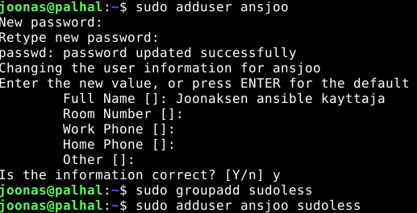

Sitten lisättiin sudoless ryhmälle one-lineri millä vältetään salasanan kysyminen

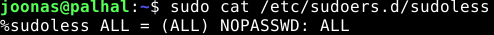

Lisättiin automaattinen ssh-kirjautuminen

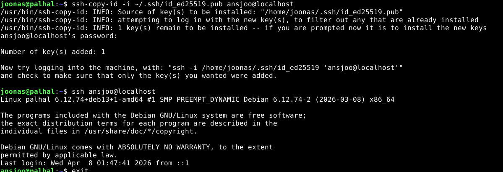

Testattiin toimiiko. 

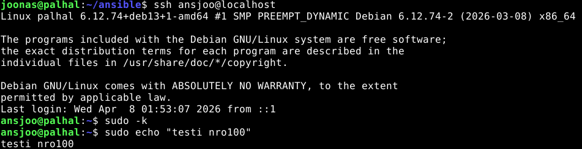


# b) Antero. Tee salasanaton, automaattisesti ssh:lla kirjautuva tunnus Ansiblella.

Tässä tehtiin ansibleen rooli `ansjoo` joka luo ryhmän `sudoless` sekä käyttäjän `ansjoo` joka kuuluu `sudoless`, `sudo` ja `adm` ryhmiin. 

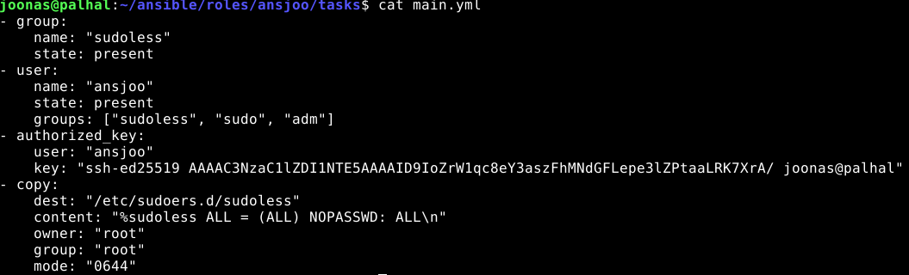

Muistettiin lisätä `site.yml` -tiedostoon uusi ajettava `ansjoo` -rooli

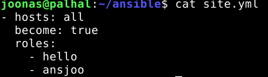

Sitten vain ajelemaan `ansible-playbook`:ia. `-K` on sama kuin `--ask-become-password`

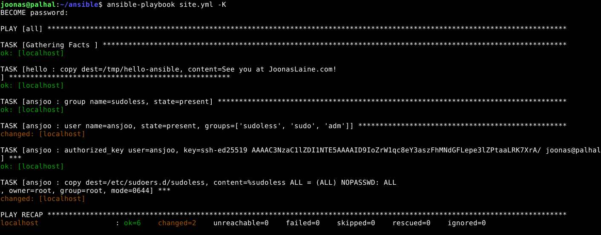

# c) Package. Asenna kaksi pakettia ansiblella.

Tehtiin uusi rooli `asennus` ansibleen ja lisättiin roolin `main.yml`-tiedostoon paketit jotka haluamme asentaa

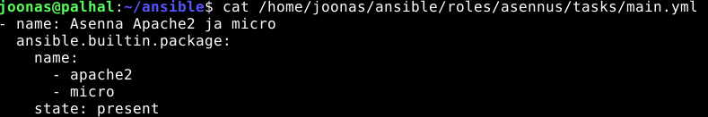

Tämä sopii myös kohtaan **"e) Jotain muuta"** sillä tätä `ansible.builtin.package` ei olla vielä kurssilla käsitelty

# d) File

Kirjoitin tmp-kansioon monirivi.txt Ansiblen avulla.

Ensiksi luotiin uusi rooli `monirivi` ja lisättiin /tasks/main.yml -tiedostoon tarvittavat tiedot

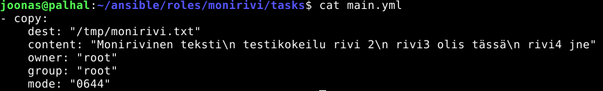

Muistettiin lisätä taas uusi rooli ajettaviin ja ajettiin `ansible-playbook site.yml -K`

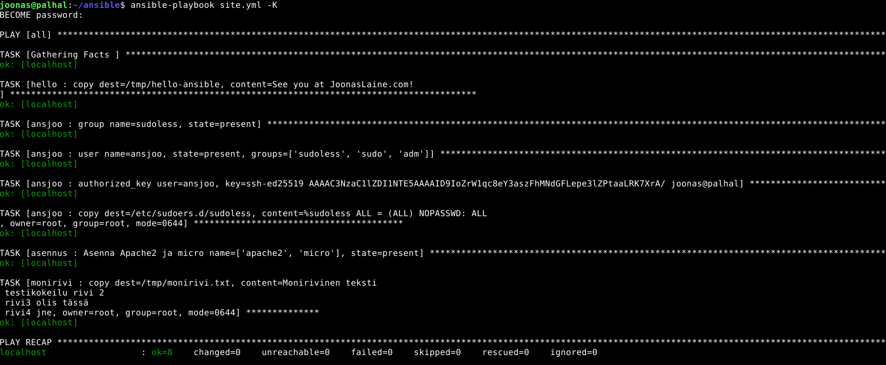

Testattiin luotiinko tiedosto `monirivi.txt` kuten tarkoitus oli ja oliko se oikeasti useammalla rivillä

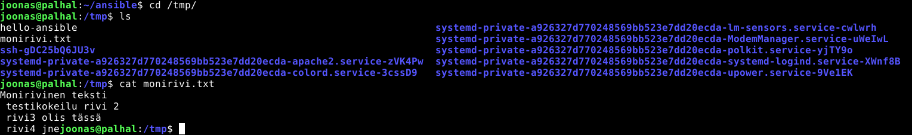


## Lähteet:

https://terokarvinen.com/palvelinten-hallinta/

https://terokarvinen.com/passwordless-sudo/

https://terokarvinen.com/passwordless-sudo-with-ansible/

https://docs.ansible.com/projects/ansible/latest/collections/ansible/builtin/package_module.html

Tekstin jäsentelyyn ja ulkoasuun käytetty apuna [Perplexity tekoälyä](https://www.perplexity.ai/)
