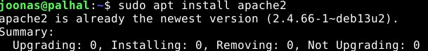
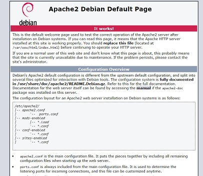
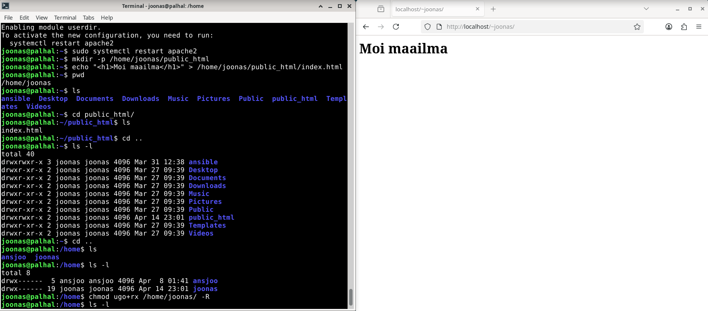
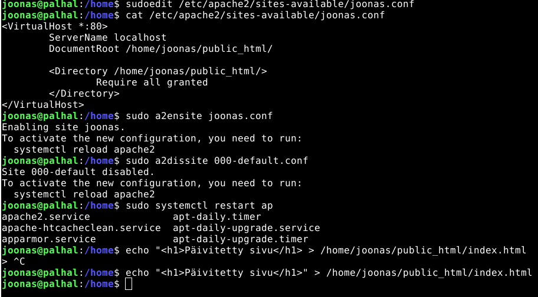
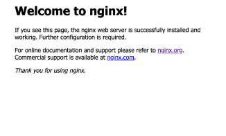
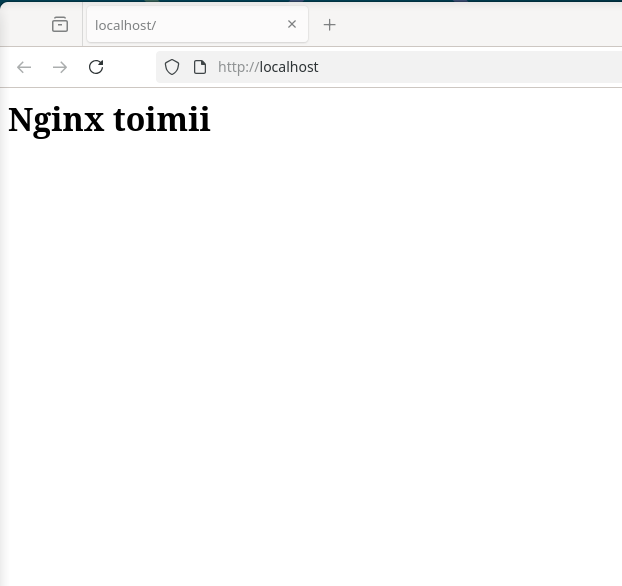
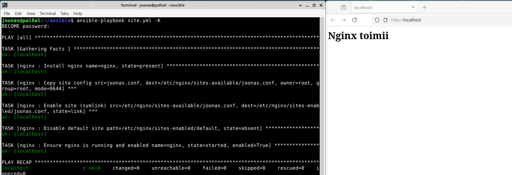

# h3 – Package, File, Service

Tekijä: Joonas Laine  
Kurssi: Palvelinten hallinta  
Päivämäärä: 14.04.2026  
Ympäristö: Debian 13

---

## x) Tiivistelmät

### Karvinen 2026: Apache installed with Ansible – quick notes

- Apache2 asennetaan ja konfiguroidaan **package-file-service**-kaavalla: ensin paketti (`apt`), sitten konfiguraatiotiedostot (`copy`/`file`), lopuksi demoni käynnistyy uudelleen handlerin kautta (`systemd`)
- VirtualHost-konfiguraatio kopioidaan `files/`-hakemistosta kohteen `/etc/apache2/sites-available/`-kansioon, ja symlink `sites-enabled/`-kansioon luodaan `file`-moduulilla `state: link` -parametrilla – `a2ensite`-komentoa ei tarvita erikseen
- Konfiguraatiotiedostoa muuttavat taskit tekevät `notify: restart apache2`, jolloin handler käynnistää palvelun uudelleen vain muutoksen tapahtuessa
- Roolin hakemistorakenne: `roles/apache2/tasks/main.yml`, `roles/apache2/handlers/main.yml`, `roles/apache2/files/example.com.conf`
- Artikkeli on tarkoituksellisesti lyhyet muistiinpanot ("just notes, no tutorial") – edellyttää toimivaa Ansible-ympäristöä

**Oma huomio:** Symlink luodaan suoraan `file`-moduulilla `state: link` -parametrilla, mikä korvaa `a2ensite`-komennon ilman shell-taskeja. Onko tässä lähestymistavassa heikkous, jos symlink jo on olemassa mutta osoittaa väärään kohteeseen?

---

### Ansible Community Documentation: Handlers: running operations on change

**Johdantokappale:**

- Handlerit ovat taskeja, jotka suoritetaan vain kun jokin task ilmoittaa muutoksesta `notify`-avainsanalla
- Tyypillinen käyttötapaus: palvelun uudelleenkäynnistys vain silloin kun konfiguraatio muuttui – ei joka ajon yhteydessä
- Handlerit ajetaan oletuksena vasta playn kaikkien taskien jälkeen, ei välittömästi `notify`-kutsun kohdalla
- Sama handler ajetaan vain kerran per play, vaikka useampi task notifioisi sen

**Notifying handlers:**

- Task notifioi handleria `notify`-avainsanalla; arvona handlerin nimi merkkijonona tai lista nimistä
- `listen`-avainsanalla handler voi kuunnella aihetta (topic) oman nimensä sijaan, jolloin useita handlereitä voidaan laukaista yhdellä `notify`-kutsulla
- Handlerit suoritetaan aina siinä järjestyksessä kuin ne on playbookissa määritelty, ei `notify`-listan järjestyksessä
- Jos handlereitä tarvitaan kesken playn, käytetään `meta: flush_handlers` -taskia
- Jokaisella handlerilla tulee olla globaalisti uniikki nimi – saman nimen saadessa vain viimeisin suoritetaan

**Oma huomio:** Handler laukeaa vasta playn lopussa, joten jos play kaatuu kesken, handler ei aja lainkaan. Tämä voi johtaa tilanteeseen, jossa konfiguraatio on muuttunut mutta palvelua ei ole käynnistetty uudelleen. `meta: flush_handlers` on ratkaisu, jos järjestyksellä on väliä.

---

### `ansible-doc service`

**Johdantokappale (MODULE alta):**

- `ansible.builtin.service` hallinnoi palveluita etäkoneella
- Toimii eri init-järjestelmien kanssa (systemd, sysvinit, upstart jne.) – Ansible tunnistaa oikean automaattisesti
- Ei korvaa service managerin omaa konfiguraatiota, vain hallinnoi palvelun nykyistä tilaa

**`enabled`:**

- Määrittää käynnistyykö palvelu automaattisesti järjestelmän käynnistyessä (`true`/`false`)
- Riippumaton `state`-parametrista: palvelu voidaan pysäyttää mutta pitää automaattikäynnistys päällä, tai päinvastoin

**`name`:**

- Palvelun nimi sellaisena kuin init-järjestelmä sen tunnistaa
- Esim. `apache2` Debianilla, `httpd` Red Hat -jakeluilla, `nginx` molemmilla

**`state`:**

- Haluttu tila: `started`, `stopped`, `restarted`, `reloaded`
- `reloaded` lataa konfiguraation uudelleen ilman katkosta (jos palvelu tukee), `restarted` sammuttaa ja käynnistää kokonaan uudelleen

**EXAMPLES:**

- `state: started` + `enabled: true` – tyypillisin tuotantokäyttö, palvelu käynnissä ja automaattikäynnistys päällä
- `state: stopped` + `enabled: false` – palvelu pois käytöstä kokonaan
- `state: restarted` – tyypillisesti handlereissa konfiguraatiomuutoksen jälkeen

**Oma huomio:** Mikä ero on `restarted` vs `reloaded`? `reload` on "graceful" – olemassa olevat yhteydet eivät katkea – mutta kaikki palvelut eivät tue sitä. Apache ja Nginx tukevat `reload`ia, joten handlereissa `reloaded` olisi usein parempi valinta kuin `restarted`, jos palvelun saatavuus on tärkeää.

---

## a) Apassi – Apache2 käsin

### Asennus

```bash
sudo apt update
sudo apt install apache2
```



Apache2:n oletussivu näkyy osoitteessa `http://localhost`.



### Kotihakemisto käyttäjälle ilman sudoa

```bash
sudo a2enmod userdir
sudo systemctl restart apache2
mkdir -p /home/joonas/public_html
echo "<h1>Moi maailma</h1>" > /home/joonas/public_html/index.html
```

Sivu näkyy osoitteessa `http://localhost/~joonas/` ilman root-oikeuksia.



Jos tämä ei suoraan toimi niin ```chmod ugo+rx /path/to/ -R```, minun tapauksessa ```chmod ugo+rx /home/joonas/ -R```

### Etusivun vaihto VirtualHostilla

```bash
sudoedit /etc/apache2/sites-available/joonas.conf
```

```apache
<VirtualHost *:80>
    ServerName localhost
    DocumentRoot /home/joonas/public_html/

    <Directory /home/joonas/public_html/>
        Require all granted
    </Directory>
</VirtualHost>
```

```bash
sudo a2ensite joonas.conf
sudo a2dissite 000-default.conf
sudo systemctl restart apache2
```

Etusivu `http://localhost` näyttää nyt tavallisen käyttäjän hakemiston. Sivua voi muokata ilman sudoa:

```bash
echo "<h1>Päivitetty sivu</h1>" > /home/joonas/public_html/index.html
```



---

## b) Moottorix – Nginx käsin

### Apache pois ensin

```bash
sudo systemctl stop apache2
sudo systemctl disable apache2
```

### Nginxin asennus

```bash
sudo apt-get install nginx
curl http://localhost
```

Nginx:n oletussivu näkyy.



### Käyttäjän sivu etusivulle

```bash
sudoedit /etc/nginx/sites-available/joonas
```

```nginx
server {
    listen 80 default_server;
    root /home/joonas/public_html;
    index index.html;

    location / {
        try_files $uri $uri/ =404;
    }
}
```

```bash
sudo ln -s /etc/nginx/sites-available/joonas /etc/nginx/sites-enabled/
sudo rm /etc/nginx/sites-enabled/default
sudo systemctl restart nginx
```

Sivu toimii ja on tavallisen käyttäjän muokattavissa:

```bash
echo "<h1>Nginx toimii</h1>" > /home/joonas/public_html/index.html
curl http://localhost
```



---

## c) Automoottorix – Nginx Ansiblella

### Hakemistorakenne

```
roles/nginx/
├── files/
│   └── joonas.conf
├── handlers/
│   └── main.yml
└── tasks/
    └── main.yml
```

### tasks/main.yml

```yaml
- name: Install nginx
  apt:
    name: nginx
    state: present

- name: Copy site config
  copy:
    src: joonas.conf
    dest: /etc/nginx/sites-available/joonas.conf
    owner: root
    group: root
    mode: "0644"
  notify: restart nginx

- name: Enable site (symlink)
  file:
    src: /etc/nginx/sites-available/joonas.conf
    dest: /etc/nginx/sites-enabled/joonas.conf
    state: link
  notify: restart nginx

- name: Disable default site
  file:
    path: /etc/nginx/sites-enabled/default
    state: absent
  notify: restart nginx

- name: Ensure nginx is running and enabled
  service:
    name: nginx
    state: started
    enabled: true
```

### handlers/main.yml

```yaml
- name: restart nginx
  systemd:
    name: nginx
    state: restarted
```

### files/joonas.conf

```nginx
server {
    listen 80 default_server;
    root /home/joonas/public_html;
    index index.html;

    location / {
        try_files $uri $uri/ =404;
    }
}
```

### Playn ajo

```bash
ansible-playbook site.yml
```



```bash
curl http://localhost
```


---

## Lähteet

- Karvinen, T. 2026. Apache installed with Ansible – quick notes. https://terokarvinen.com/apache-ansible/
- Ansible Community Documentation. Handlers: running operations on change. https://docs.ansible.com/projects/ansible/latest/playbook_guide/playbooks_handlers.html
- Ansible Community Documentation. ansible.builtin.service. `ansible-doc service`
