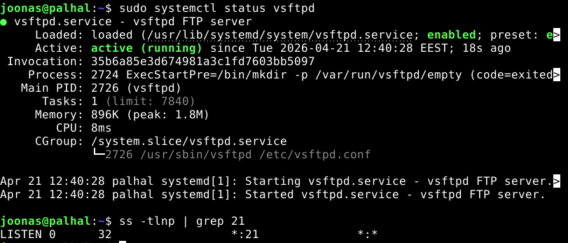
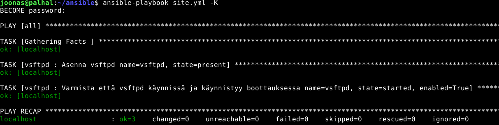
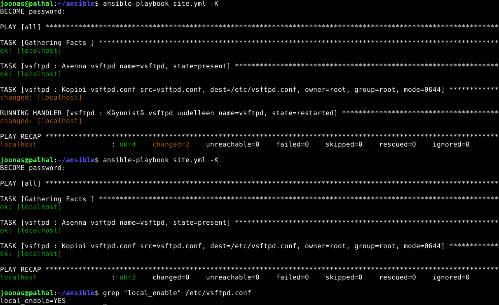
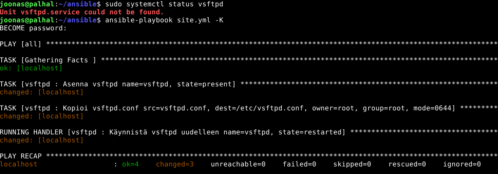
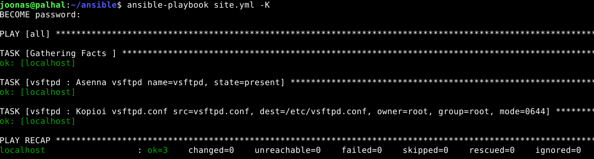

Tekijä: Joonas Laine

Kurssi: [Palvelinten hallinta](https://terokarvinen.com/palvelinten-hallinta/)

Päivämäärä: 21.04.2026

Ympäristö: Debian13, VirtualBox

# h4 Pizza Fantasia


---

## x) Tiivistelmä - Karvinen 2023: Configuration Management of Distributed Systems

### 4.12.1 Size and Complexity of Some DSLs (s. 112)

- Saltin DSL sisältää **510 tilatoimintoa** ja yli 75 000 sanan dokumentaation - enemmän kuin tyypillinen väitöskirja
- Puppet tarjoaa 113 funktiota ilman kontrollirakenteitä, ja Puppetin omat kontrollirakenteet poikkeavat merkittävästi yleisistä ohjelmointikielistä
- Salt käyttää Jinja2-mallipohjia YAML-koodin generointiin, mikä lisää abstraktiotasoja
- **Oma huomio:** DSL:n suuri koko voi kasvattaa kognitiivista kuormaa. Onko järkeä opetella 510 toimintoa, jos käytännössä riittää kymmenkunta?

### 4.12.2 Use of DSL Functions in Case Configuration (s. 112-115)

- Analyysi Mozilla Engineering ja USGCB Puppet-manifesteista osoittaa, että **pieni joukko funktioita kattaa valtaosan käytöstä**
- Mozillan manifesteissa 87 % komennoista koostuu vain 12 yleisimmästä - tärkeimpinä `file`, `package`, `exec`, `service`
- USGCB:ssä yleisimmät olivat `augeas`, `file`, `service`, `exec` ja `package`
- Klassinen **package-file-service** -kaava toistuu molemmissa aineistoissa selvästi
- **Oma huomio:** Tulos vahvistaa intuitiota - riittää oppia muutama perusprimitiivi hyvin, eikä tarvitse hallita koko DSL:ää.

### 4.12.3.1 Dependencies Between Main Functions (s. 115-117)

- CM:n ydintoiminnot ovat: `package`, `file`, `service`, `user`, `group`, `exec` (+ `directory`, `symlink`)
- Riippuvuusgraafissa **vain `exec` ja `file` vaikuttavat suoraan agenttijärjestelmään** - muut funktiot rakentuvat näiden päälle
- Idempotenttisuus toteutetaan "if"-tarkistuksilla: muutos tehdään vain jos järjestelmä ei ole jo oikeassa tilassa
- Conftero ratkaisee riippuvuushallinnan `hasChanges()`-lipulla: jos jokin funktio teki muutoksen, palvelu käynnistetään uudelleen - käyttäjän ei tarvitse hallita riippuvuusgraafeja itse
- **Oma huomio:** `hasChanges()`-lähestymistapa on elegantti - Salt ja Puppet pakottavat käyttäjän kirjoittamaan `watch`/`notify`-riippuvuuksia erikseen jokaiselle resurssille, mikä täyttää koodin boilerplatella.

---

## a) Räpylä - demonin manuaalinen asennus

**Valittu demoni:** `vsftpd` (Very Secure FTP Daemon)


```bash
sudo apt update
sudo apt install -y vsftpd
sudo systemctl status vsftpd
```

**Testaus:**

```bash
# Tarkista että demoni on käynnissä
sudo systemctl status vsftpd
```



---

## b) Automaatti - Ansiblen avulla

**Hakemistorakenne:**

```
ansible/
├── hosts.ini
├── ansible.cfg
├── site.yml
└── roles/
    └── vsftpd/
        └── tasks/
            └── main.yml
```


**roles/vsftpd/tasks/main.yml:**

```yaml
---
- name: Asenna vsftpd
  apt:
    name: vsftpd
    state: present

- name: Varmista että vsftpd käynnissä ja käynnistyy boottauksessa
  service:
    name: vsftpd
    state: started
    enabled: true
```

**site.yml:**

```yaml
---
- hosts: all
  become: true
  roles:
    - vsftpd
```

**Ajo:**

```bash
ansible-playbook site.yml -K
```



---

## c) Asetus - konfiguraatiotiedoston muutos

Lisätään rooliin tehtävä joka kopioi muokatun `vsftpd.conf`:in kohdekoneen päälle.

**roles/vsftpd/files/vsftpd.conf** (esimerkki muutoksesta, esim. `local_enable=YES`):

```
listen=NO
listen_ipv6=YES
anonymous_enable=NO
local_enable=YES
write_enable=YES
dirmessage_enable=YES
use_localtime=YES
xferlog_enable=YES
connect_from_port_20=YES
```

**Lisäys roles/vsftpd/tasks/main.yml:**

```yaml
- name: Kopioi vsftpd.conf
  copy:
    src: vsftpd.conf
    dest: /etc/vsftpd.conf
    owner: root
    group: root
    mode: '0644'
  notify: Käynnistä vsftpd uudelleen

- name: Käynnistä vsftpd uudelleen
  service:
    name: vsftpd
    state: restarted
```

*Tai käytä `notify` + `handlers` -rakennetta:*

**roles/vsftpd/handlers/main.yml:**

```yaml
---
- name: Käynnistä vsftpd uudelleen
  service:
    name: vsftpd
    state: restarted
```

**Ajo ja tarkistus:**

```bash
ansible-playbook site.yml -K

# Tarkista että asetus tuli voimaan
grep "local_enable" /etc/vsftpd.conf
```



---

## d) Paikka remonttiin - rikkominen ja korjaus

**Rikotaan tilanne poistamalla paketti:**

```bash
sudo apt purge vsftpd
sudo systemctl status vsftpd   # pitäisi epäonnistua
```

**Ansible korjaa tilanteen:**

```bash
ansible-playbook site.yml -K
```



---

## e) Idempotentti

**Ajetaan playbook uudelleen muuttamatta mitään:**

```bash
ansible-playbook site.yml -K
```

**Odotettu tulos:** Kaikki taskit näyttävät `ok` eikä yhtään `changed`-riviä ilmesty.



Idempotenttisuus toteutuu koska:
- `package` tarkistaa onko paketti jo asennettu ennen asennusta
- `service` tarkistaa onko palvelu jo käynnissä
- `copy` vertaa tiedoston sisältöä ennen kopiointia - kopioi vain jos on muutos

---

## Lähteet

https://terokarvinen.com/palvelinten-hallinta/

https://westminsterresearch.westminster.ac.uk/download/4cc417566aa9af60fe3826d690719e390abdb7a3c8672f3d51b1eb4ca75e7624/1427236/karvinen-2023-configuration-management-of-distributed-systems.pdf

Raportin jäsentelyyn käytetty [Claude](https://claude.ai)-tekoälyä
