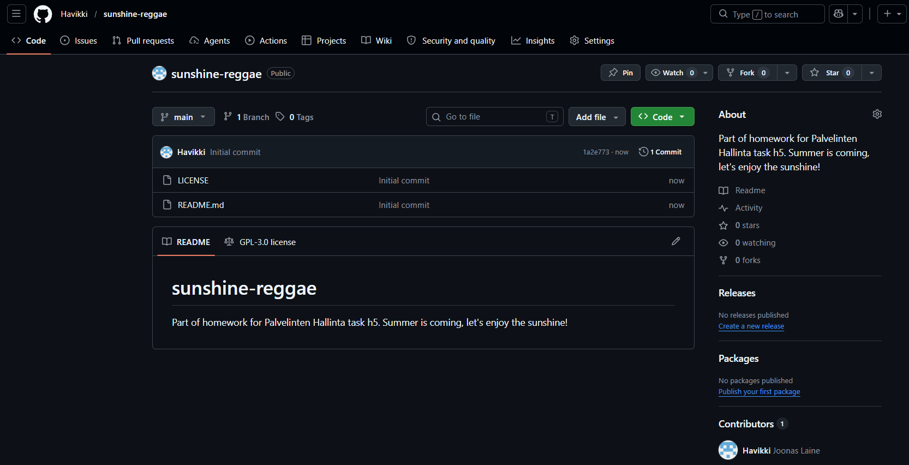
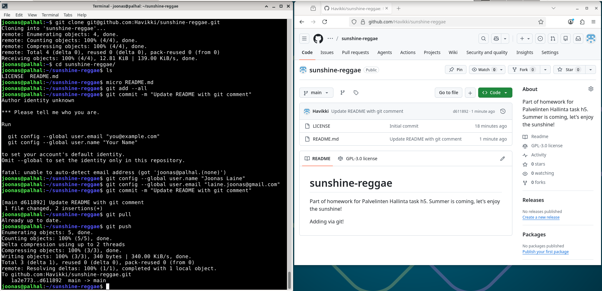
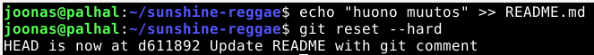
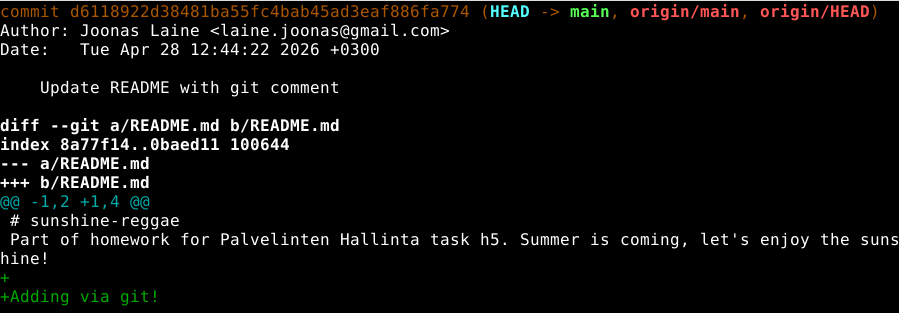
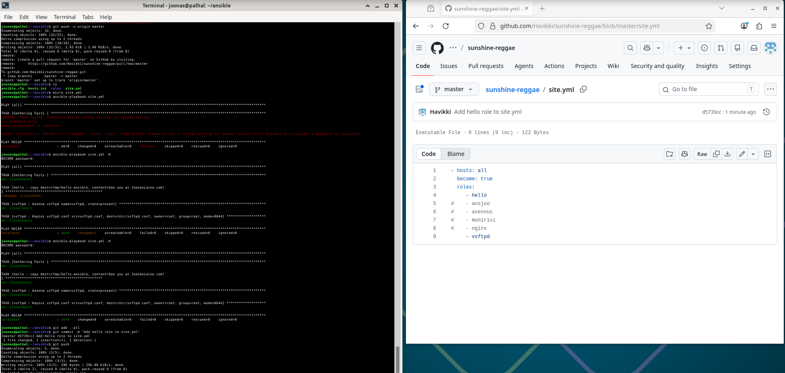

# h5 Gitar Hero

Tekijä: Joonas Laine

Kurssi: [Palvelinten hallinta](https://terokarvinen.com/palvelinten-hallinta/)

Päivämäärä: 28.04.2026

---

## x) Tiivistelmät

### Chacon and Straub 2014: Pro Git, 2ed - 1.3 What is Git?

- Git tallentaa tiedostojen tilannekuvia (snapshots), ei eroja tiedostoversioiden välillä kuten muut versionhallintajärjestelmät
- Suurin osa Gitin toiminnoista tapahtuu paikallisesti - verkkoyhteys ei ole tarpeen historiatietojen selaamiseen
- Git käyttää SHA-1-tiivisteitä tietojen eheyden varmistamiseen; kaikki viitteet perustuvat näihin tarkistussummiin
- Git lisää tietoa tietokantaan, harvoin poistaa - siksi virheiden tekeminen on turvallista
- Oma havainto: Gitin snapshot-malli selittää, miksi haarojen luominen ja vaihteleminen on niin nopeaa verrattuna esim. SVN:ään

### `git add --all && git commit; git pull && git push` - komennon osat selitettynä

- `git add --all` - lisää kaikki muuttuneet, uudet ja poistetut tiedostot staging-alueelle (indeksiin). `--all`-lippu sisällyttää myös poistetut tiedostot, pelkkä `git add .` ei välttämättä tee sitä vanhemmissa Git-versioissa. (Lähde: [git-scm.com - git-add](https://git-scm.com/docs/git-add))
- `git commit` - tallentaa staging-alueen muutokset paikalliseen historiaan. Ilman `-m`-lippua Git avaa oletustekstieditorin commit-viestin kirjoittamista varten. (Lähde: [git-scm.com - git-commit](https://git-scm.com/docs/git-commit))
- `;` - komentotulkin erotinmerkki: seuraava komento suoritetaan aina edellisen tuloksesta riippumatta (toisin kuin `&&`, joka vaatii onnistumisen)
- `git pull` - hakee muutokset etävarastosta ja yhdistää ne paikalliseen haaraan. Estää push-konfliktin, jos etävarastoon on tullut muutoksia välillä. (Lähde: [git-scm.com - git-pull](https://git-scm.com/docs/git-pull))
- `git push` - lähettää paikalliset commitit etävarastoon (esim. GitHub). (Lähde: [git-scm.com - git-push](https://git-scm.com/docs/git-push))

---

## a) Online - uusi varasto GitHubiin

Loin uuden julkisen varaston GitHubiin. Varaston nimessä ja kuvauksessa esiintyy sana "sunshine". Varasto luotiin suoraan GitHubin web-käyttöliittymässä, ja luomisvaiheessa lisättiin README.md sekä GNU General Public License v3.



---

## b) Dolly - kloonaus ja muutosten pushaaminen

Kloonasin varaston SSH-osoitteen avulla:

```bash
git clone git@github.com:Havikki/sunshine-reggae.git
cd sunshine-reggae
```

Tein muutoksen:

```bash
micro README.md
git add --all
git commit -m "Update README with git comment"
git pull
git push
```

Kuten kuvastakin huomaa, ensimmäistä kertaa käyttäessä on lisättävä oma nimi ja sähköpostiosoite komennoilla ```git config --global user.email``` ja ```git config --global user.name```



---

## c) Doh! - tyhmä muutos ja resetointi

Tein huonon muutoksen tiedostoon committaamatta:

```bash
echo "huono muutos" >> README.md
```

Peruutin muutoksen `git reset --hard` -komennolla, joka palauttaa työhakemiston viimeisimmän commitin tilaan. Tässä toiminnossa ei ole peruutusnappia - tallentamattomat muutokset häviävät pysyvästi:

```bash
git reset --hard
```



---

## d) Tukki - lokin tarkastelu

Tarkastelin varaston historiaa:

```bash
git log --patch
```

`git log` näyttää commitien historian. `--patch`-lippu (tai `-p`) näyttää jokaisen commitin yhteydessä myös tarkat tiedostomuutokset (diff). Tulosteessa näkyy:
- commitin SHA-1-tunniste
- tekijä ja sähköpostiosoite
- aikaleima
- commit-viesti
- muutetut rivit (+ lisätyt, - poistetut)




---

## e) Gitanbile - Ansible-kansio versionhallintaan


Lisäsin Ansible-hakemiston versionhallintaan:

```bash
cd ~/ansible   # tai hakemistosi polku
git init
git remote add origin git@github.com:Havikki/VARASTON-NIMI.git
git add --all
git commit -m "Add initial Ansible configuration"
git push -u origin master
```

Tein muutoksen Ansible-tiedostoon, ajoin playbookin ja tallensin version:

```bash
micro site.yml
ansible-playbook site.yml
git add --all
git commit -m "Add hello role to site.yml"
git push
```



**Edit 28.04.2026 klo 14:56**: Tässä ei vissiin tarkoituksena ollutkaan upata tiedostoja githubiin, pelkästään gittiin. Toisinsanoen ```git remote add origin``` oli turha vaihe.

---

## Lähteet

- Chacon, S. and Straub, B. 2014. Pro Git, 2nd Edition. https://git-scm.com/book/en/v2/Getting-Started-What-is-Git%3F. Luettu 28.04.2026.
- git-scm.com. Git Reference - git-add. https://git-scm.com/docs/git-add
- git-scm.com. Git Reference - git-commit. https://git-scm.com/docs/git-commit
- git-scm.com. Git Reference - git-pull. https://git-scm.com/docs/git-pull
- git-scm.com. Git Reference - git-push. https://git-scm.com/docs/git-push
- Karvinen, T. 2025. Palvelinten hallinta -kurssi. https://terokarvinen.com
- Tekstin jäsentelyyn käytetty [Claude](https://claude.ai)-tekoälyä
